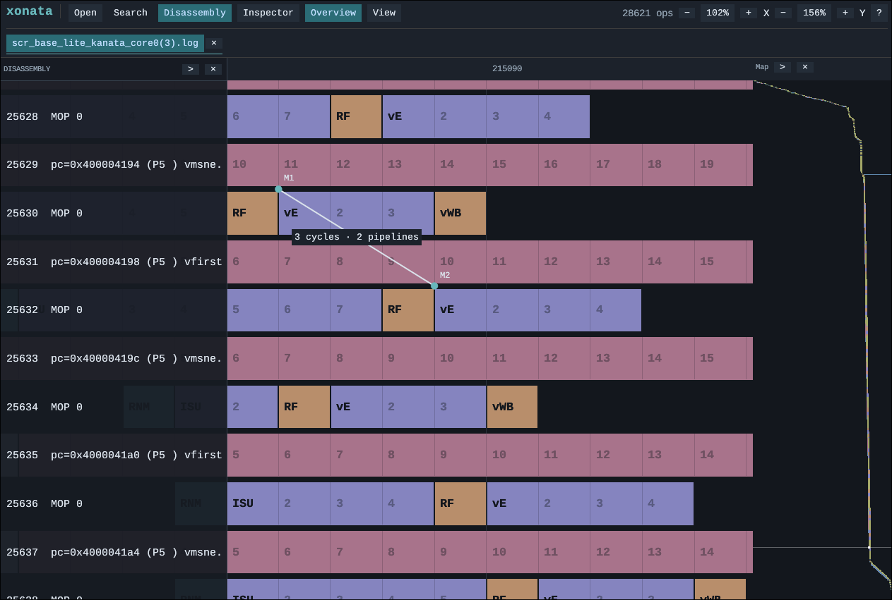

# Xonata

> [!WARNING]
> Beware! This is a completely vibecoded project...

A Rust viewer for Kanata v4 pipeline traces. Runs natively or in a browser through WebAssembly, without Electron. Browser traces stay local.



- **Explore several traces:** tabs and split view, independent cycle/row zoom, numbered cells for long phases, and a clickable whole-trace minimap.
- **Find every match:** literal or regex search across disassembly and metadata, matching snippets, filters, and navigation to the first phase.
- **Analyze phase relationships:** general constraints, signed source–target gaps, click-to-jump results, and numbered translucent interval drawings.
- **Measure the pipeline:** draggable grid markers connected by cycle and pipeline-row distances.
- **Keep the trace central:** resizable disassembly and inspector overlays, aligned rows, metadata tooltips, and a minimal monospace interface.
- **Handle large logs:** worker-based parsing, paged temporary storage, and a bounded decoded-page cache.

## Run

Install Rust (the repository toolchain includes the WASM target).

```sh
cargo run -p xonata-app
```

Use **Open** or drag in `.log`, `.gz`, or `.zst` traces.

For the browser build, generate a local lockfile and install its matching `wasm-bindgen-cli`:

```sh
cargo generate-lockfile
xonata_bindgen_version="$(python3 -c 'import pathlib, tomllib; print(next(p["version"] for p in tomllib.loads(pathlib.Path("Cargo.lock").read_text())["package"] if p["name"] == "wasm-bindgen"))')"
cargo install wasm-bindgen-cli --version "$xonata_bindgen_version" --locked
bash scripts/build-web.sh
python3 -m http.server 8000 --directory web
```

Open <http://localhost:8000/>. For integration, see [the embedding example](web/embed-example.html): `WebHandle` exposes `start(canvas)`, `open_file(file)`, `navigate(traceId, decimalOpId)`, and `destroy()`.

For a local preview of the deployment artifact:

```sh
bash scripts/build-pages.sh
python3 -m http.server 8000 --directory target/pages
```

## Controls

| Action | Control |
| --- | --- |
| Search / close popup | **F** or **Ctrl+F** / **Esc** |
| Phase / interval filtering | **Filters** → **Query / Results**, then **Run / Draw** |
| Next / previous match | **n / p**; offers a popup before wrapping |
| Horizontal zoom in / out | **Ctrl+Right / Ctrl+Left** |
| Vertical zoom in / out | **Ctrl+Up / Ctrl+Down** |
| Zoom both axes / pan / scroll | **Ctrl+wheel** or pinch / drag / wheel |
| Place / move / remove marker | **Shift+click** / drag its dot / hover its dot and press **Delete** |
| Toggle whole-trace overview | **M** or **Overview** in the header |
| Hotkeys guide | **?** |

The overview fits all pipeline rows and cycles into a full-height strip. Click or drag to jump to a row’s first phase; the white indicator tracks the current viewport. Drag its left edge to resize, use **> / <** to expand or compact it, or **×** to hide it.

Shortcuts for letters and zoom are inactive while typing. **X/Y** percentages reset each zoom axis. Click a phase or disassembly row to inspect metadata. Drag the disassembly edge to resize it; **> / <** expands or compacts it. **Inspector → Markers** provides editing, **×** removal, and **Clear markers**. Markers last for the session. **View** contains split view, the flushed-operation filter, and jumps by operation or retired ID.

## Phase and interval filters

Open **Filters → Query** and choose **Single phases** or **Intervals between phases**. Fill in instruction, phase, and metadata fields; empty fields accept any value. **▾** offers up to 16 suggestions from the loaded trace. Type to narrow them, or enter your own value. Suggestions are examples, not an exhaustive list.

Instruction and metadata use case-insensitive **contains** matching. Use `*` to match any text within a line: `FREE RQU *=36` can occur anywhere in a metadata line. Phase and lane fields match whole names, with wildcards available.

For the example interval, fill in:

| Field | From | To |
| --- | --- | --- |
| Instruction contains | `vfirst` | `vmsne` |
| Phase is | `E` | `E` |
| Boundary | End | Start |
| Metadata contains | `FREE RQU *=36` | empty |

**Results** defaults to **Delays only (≥ 0 cycles)**. Choose **Overlaps only** or **Delays and overlaps** to include negative gaps. The gap is target cycle − source cycle; negative means the target started before the source ended. Each source occurrence pairs with the next matching later instruction row in the same thread. Gap constraints apply *after* pairing; excluded overlaps do not choose a more distant target. Repeated target phases use their earliest matching endpoint. Unknown requested End boundaries are skipped and counted.

**More conditions** adds lane/status constraints, numeric comparisons (duration, cycle, operation/global/retired ID, thread), scoped metadata contains fields, and explicit regex fields. **Advanced pairing and drawing** contains target skip count, gap and row-distance limits, drawing row span, and padding.

For interval queries, enable **Exclude between (optional)** and fill in the same instruction, phase, boundary, metadata, and advanced fields as FROM/TO. Choose **Intervening rows** to check only rows strictly between the endpoints, or **Any pipeline row** to check all rows, including other threads. A pair is rejected when a matching Start/End boundary falls strictly inside its cycle interval; boundaries exactly at FROM/TO do not count. Negative intervals use the same two cycle bounds, and a zero-length interval has no interior. Exclusion is checked after pairing and never substitutes a later TO. Disable the section to keep its values without applying them.


Press **Run** after loading finishes. **Results** lists numbered matches with cycle counts; click one to jump without changing zoom. **Draw** replaces this trace's previous drawing set, using an optional label. **Show drawings** toggles visibility; **Clear drawings** removes them. Single-phase drawings follow lane slabs; intervals normally span both endpoint rows. At most **2,048 visible rectangles** are drawn, with the selected result prioritized. All matches remain in the paged list. Drawings and query state last for the session; drawing reveals flushed rows to preserve row geometry.

In **Results**, click **Elapsed cycles ↓ / ↑** to toggle highest-first / lowest-first sorting. Result numbers stay stable, and **Draw** includes all matches regardless of their order. Rectangle labels show the result number and elapsed cycles, including a negative count and “overlap” for overlapping intervals.

Filters match each pipeline row directly; separate micro-operation rows are not automatically associated with a parent instruction. A trace may put `E` on a named instruction and `vE` on a separate `MOP` row.

Browser embeds can observe `xonata:filter_suggestions`, `xonata:filter_progress`, `xonata:filter_results`, `xonata:filter_sort_progress`, `xonata:filter_sorted_results`, `xonata:filter_drawn`, `xonata:filter_drawing`, and `xonata:filter_error` canvas events (JSON detail). Filter IDs, cycles, row indexes, counts, and elapsed values are decimal strings to preserve precision.

Development and verification instructions are in [AGENTS.md](AGENTS.md). Bundled Liberation Mono fonts include their [license](crates/app/assets/fonts/LICENSE).
